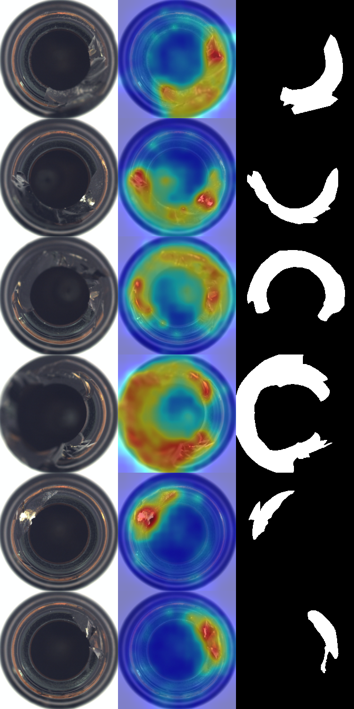

# 🔍 DefectEye — Industrial Anomaly Detection

> Unsupervised visual defect detection that learns from **defect-free images only**, yet localizes never-before-seen defects with a pixel-level heatmap.

  

DefectEye is a from-scratch implementation of **PaDiM** (Patch Distribution Modeling) for industrial quality control. Instead of training a classifier on labeled defects — which factories rarely have — it models what *normal* looks like and flags anything that deviates. This is the same paradigm used in real manufacturing QC (textiles, PCBs, pharmaceuticals).

<!-- Replace with your own GIF/screenshot after running the demo -->
<!--  -->

**🔗 Live demo:** _add your Hugging Face Spaces link here_
**📓 Training notebook:** [`notebooks/DefectEye_Kaggle.ipynb`](notebooks/DefectEye_Kaggle.ipynb)

---

## ✨ Why this project stands out

- **No defect labels needed** — trains only on good samples (the realistic industrial setting).
- **Pixel-level localization** — not just "defect / no defect", it shows *where* on a heatmap.
- **Implemented from scratch** — the PaDiM math (multi-scale embeddings, per-patch Gaussians, Mahalanobis distance) is written out in clean PyTorch, not hidden behind a library call.
- **Full pipeline** — data → model → evaluation (AUROC) → deployable web demo.
- **Runs anywhere** — CPU-friendly with `resnet18`, GPU-accelerated with `wide_resnet50_2`.

## 🧠 How PaDiM works

```
defect-free images
      │
      ▼
frozen pretrained CNN  ──►  multi-scale patch embeddings (layer1+2+3)
      │
      ▼
per patch position:  fit a Gaussian  N(mean, covariance)
      │
      ▼   (test image)
Mahalanobis distance of each patch to its Gaussian  ──►  anomaly heatmap
```

A patch that looks unlike anything in the normal data gets a high Mahalanobis distance → highlighted as a likely defect. No gradient training is required; "fitting" is just estimating per-position statistics.

## 📊 Results (MVTec AD)

Fill in after running `src.evaluate`. Reported metric is AUROC (higher is better).

| Category | Backbone | Image AUROC | Pixel AUROC |
|----------|----------|-------------|-------------|
| bottle   | wide_resnet50_2 | _–_ | _–_ |
| hazelnut | wide_resnet50_2 | _–_ | _–_ |
| cable    | wide_resnet50_2 | _–_ | _–_ |

> Reference (PaDiM paper, WideResNet-50): ~0.98 image-level / ~0.98 pixel-level averaged across MVTec categories.

Sample output (input | prediction | ground truth):

<!--  -->

## 🚀 Quickstart

### Option A — Kaggle (recommended, free GPU, dataset pre-hosted)

1. Open [`notebooks/DefectEye_Kaggle.ipynb`](notebooks/DefectEye_Kaggle.ipynb) on Kaggle.
2. **Add Data** → search **MVTec AD** → attach it.
3. **Settings → Accelerator → GPU**.
4. **Run All**. It clones this repo, trains, evaluates, and shows heatmaps.

### Option B — Local

```bash
pip install -r requirements.txt

# 1) train on one category (defect-free images only)
python -m src.train    --data_root path/to/mvtec --category bottle --backbone wide_resnet50_2

# 2) evaluate: prints AUROC, saves a sample grid to results/
python -m src.evaluate --data_root path/to/mvtec --category bottle --backbone wide_resnet50_2 \
                       --model models/bottle_wide_resnet50_2.pt

# 3) launch the interactive demo
python app.py
```

> CPU? Use `--backbone resnet18` for a light, fast run.

## 🌐 Deploy the demo (Hugging Face Spaces)

1. Create a new **Gradio** Space.
2. Upload the repo + a trained `models/<category>_<backbone>.pt`.
3. Spaces auto-runs `app.py` → you get a public live link for your portfolio.

## 🗂️ Project structure

```
DefectEye/
├── app.py                  # Gradio demo (HF Spaces entry point)
├── requirements.txt
├── src/
│   ├── backbone.py         # frozen pretrained feature extractor
│   ├── padim.py            # PaDiM: fit / predict / calibrate
│   ├── dataset.py          # MVTec AD loader
│   ├── train.py            # CLI: fit + save a model
│   ├── evaluate.py         # CLI: AUROC + sample heatmaps
│   └── utils.py            # heatmap rendering, smoothing
├── notebooks/
│   └── DefectEye_Kaggle.ipynb
├── data/                   # (gitignored) dataset
├── models/                 # (gitignored) trained .pt files
└── results/                # metrics + sample images
```

## 📚 Dataset

[**MVTec AD**](https://www.mvtec.com/company/research/datasets/mvtec-ad) — 15 categories of industrial objects/textures with pixel-accurate defect masks. Free for academic/non-commercial use.

## 📖 Reference

Defard et al., *PaDiM: a Patch Distribution Modeling Framework for Anomaly Detection and Localization*, 2020. [arXiv:2011.08785](https://arxiv.org/abs/2011.08785)

## 📝 License

MIT
